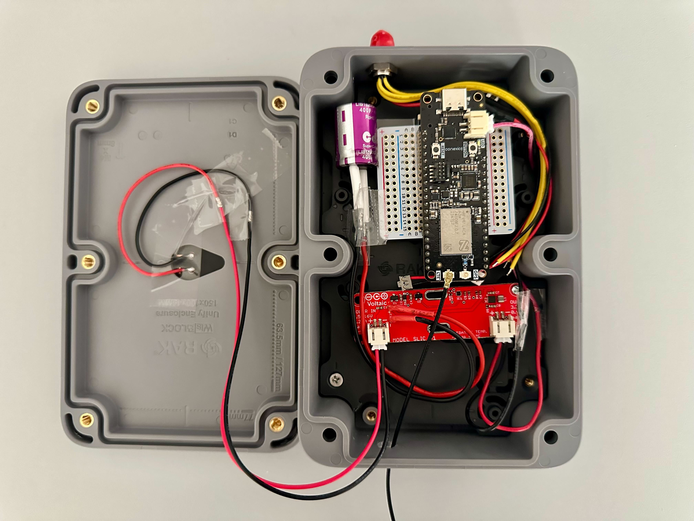
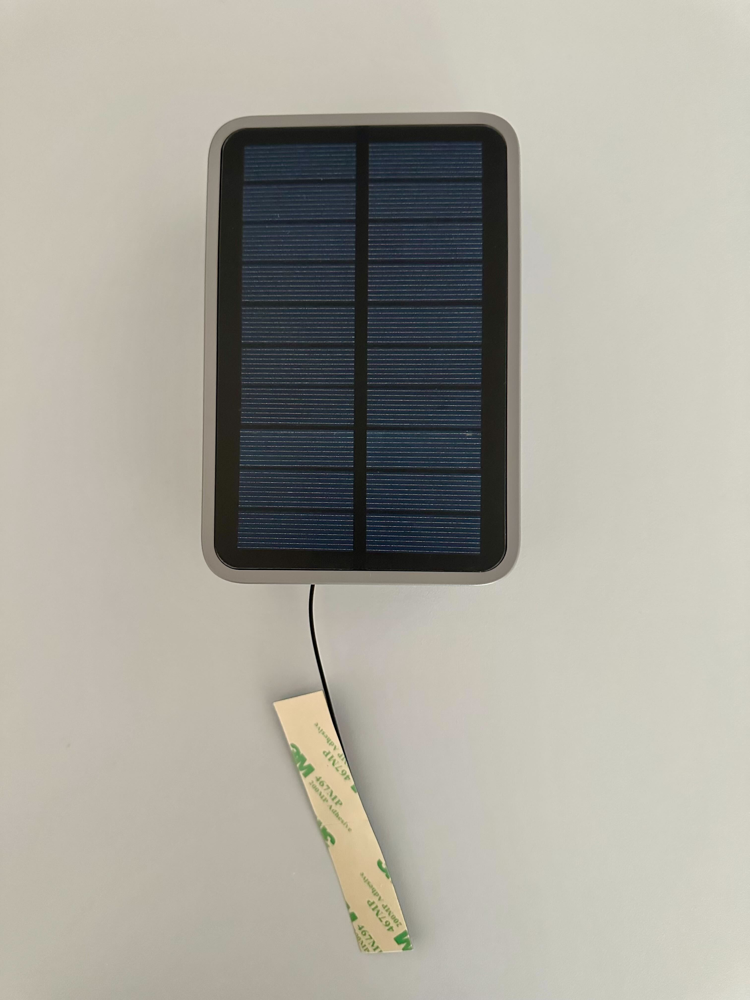

# Batteryless Cellular IoT with Conexio Stratus nRF9151/nRF9161

## Overview

The Batteryless Cellular IoT with Conexio Stratus nRF9151/nRF9161 firmware is based on Golioth Device Management and
Data Routing template that uses nRF Connect SDK. The application connects to Golioth, streams time-series
data, senor readings, and cellular based location tracking to the Golioth cloud.
From the Golioth web console you may deploy OTA firmware updates, adjust
device Settings, and issue Remote Procedure Calls (RPCs). It is set up as a standalone repository, with all
Golioth features implemented in basic form. 

## Requirements

* nRF Connect SDK version 2.9.0 installed
* Golioth SDK pre-installed for NCS v2.9.0
* Golioth account and credentials
* Network connectivity

## Hardware and Components

* Conexio Stratus Pro [nRF9151](https://conexiotech.com/shop/) or nRF9161
* Super capacitor, [LIB1620Q4R0407, 4V, 400F](https://www.digikey.com/en/products/detail/cda-zhifengwei-technology/LIB1620Q4R0407/22461729?s=N4IgTCBcDaICwDYAcSC0AZAkgIQIwLAAYBFOAJULkIHZUA5AERAF0BfIA)
* Rakwireless [Unify Enclosure with solar panel](https://store.rakwireless.com/products/unify-enclosure-ip67-150x100x45mm-with-pre-mounted-m8-5-pin-and-rp-sma-antenna-ip-rated-connectors?index=9&variant=42861623738566)
* LTE antenna

## System Overview Block Diagram







## Installing the nRF Connect SDK v2.9.0

* Download and install a cross-platform tool [nRF Connect for Desktop](https://www.nordicsemi.com/Products/Development-tools/nrf-connect-for-desktop) for your operating system.
* Install and run the nRF Connect tool on your machine.
* Click Install next to the Toolchain manager.
* Once the Toolchain manager is installed, click open.
* Select nRF Connect SDK v2.9.0 and click Install. Depending on your internet speed, it may take a few tens of minutes, so go and grab yourself a cup of coffee ☕
* Once the installation is complete, click the dropdown menu and hit Open Terminal.
* This will open the terminal in the installed directory of the nRF Connect SDK as indicated.
Hooray🎉 . You have successfully installed the NCS.
* For more info, refer to this [documentation](https://docs.conexiotech.com/master/programming-and-debugging/nrf-connect-sdk-ncs-installation).

## Installing the Golioth Firmware SDK v0.17.0

### Adding the Golioth Firmware SDK to an existing nRF Connect SDK based projects
Add the following entry to the `ncs/v2.9.0/nrf/west.yml` file of an existing West based project:

> [!NOTE]
> To ensure that default Kconfig values are propagated correctly, place
> the golioth entry first in your west manifest after the following piece of code.

```yaml
# NCS repositories.
#
# Some of these are also Zephyr modules which have NCS-specific
# changes.
# Golioth repository.
- name: golioth
  path: modules/lib/golioth-firmware-sdk
  revision: v0.17.0
  url: https://github.com/golioth/golioth-firmware-sdk.git
  submodules: true
- name: zephyr-network-info
  path: modules/lib/network-info
  revision: v1.2.1
  url: https://github.com/golioth/zephyr-network-info
```

and clone all repositories by running:

```console
west update
```

- [zephyr-network-info](https://github.com/golioth/zephyr-network-info)
    is a helper library for querying, formatting, and returning network
    connection information via Zephyr log or Golioth RPC

## Project Configuration for Low Power Mode and Sensor Sampling

In the `prj.conf` update the following configurations as per project requirements.

> [!NOTE]
> Smaller intervals mean faster sampling and more frequent data transmission to the cloud cloud. 
> Handy for testing purposes but not for final deployment due to higher power consumption.

```
# How often to sample and send environmental sensor data
CONFIG_SENSOR_SAMPLE_INTERVAL_SECONDS=3600

# How often to fetch cellular location data
CONFIG_LOCATION_TRACKING_SAMPLE_INTERVAL_SECONDS=7200
```

If you want to view the serial logs, then in the `overlay_low_power.conf`, enable serial logging by adding `y` to the following configs:

```
# Enable/disable serial logging
CONFIG_SERIAL=y
CONFIG_LOG=y
CONFIG_UART_CONSOLE=y
CONFIG_NET_SHELL=y
```

> [!NOTE]
> In production/deployment firmware all the serial logging should be disabled to put the device properly in low-power mode.

## Compiling the application using nRF Connect Extension

Prior to compiling the application, we first need to generate the device build configuration for the project by clicking on the **Add Build Configuration** option.

This opens a new tab, asking the user to select the board for which the build configurations will be generated. In our case, we will 

1) Check the **Custom** under the **Board target** option.
2) Then from the drop-down menu select the **Board target** as:
```
conexio_stratus_pro/nrf9151/ns
```
3) Under **Extra Kconfig fragments** options, browse and select `overlay_low_power.conf`.
4) Next, under **Extra Devicetree overlays**, browse and select `conexio_stratus_pro_nrf9151_ns.overlay`.
5) To generate the `app_update.bin`, select **No sysbuild** under **System build (sysbuild)** option.
6) Cick **Build Configuration** to start the Zephyr application build process.

* If any issues see the [Conexio device documentation](https://docs.conexiotech.com/master/building-and-programming-an-application/compiling-applications-with-nrf-connect-extension-for-vs-code) for detailed instructions on how to build the application.


##  Flashing and Running the Sample Application on the Device

### Setting DFU Mode (Device Firmware Upgrade)

To program the device via USB, you will need to put the device into DFU (Device Firmware Upgrade) mode first. 
This mode triggers the onboard bootloader that accepts firmware binary files. To enter DFU mode:

1) Hold down Mode button : labeled **BUTTON**
2) Press and release Reset button : **RESET**
3) Release only the RESET button, while holding down the MODE button
4) Wait for the white LED to turn on (steady-state)
5) Release the MODE button
6) The device is now in DFU mode. 🚨

### Flashing an application via USB using `newtmgr`

To upload the firmware, we now have to:

* Open the terminal within the nRF Connect extension and invoke the 
```
newtmgr -c serial image upload build/zephyr/app_update.bin 
```
making sure the device remains in DFU mode.

## Authentication specific configuration for Device Onboarding
To enable a new device so that it can connect securely to the Golioth cloud,
1) Build the firmware with serial logging enabled.

```
# Enableserial logging
CONFIG_SERIAL=y
CONFIG_LOG=y
CONFIG_UART_CONSOLE=y
CONFIG_NET_SHELL=y
```

2) Upload the firmware to the device.
3) Reset the device.
4) Configure PSK-ID and PSK using the device shell as shown below based on your Golioth project credentials and reboot:

```
uart:~$ settings set golioth/psk-id <my-psk-id@my-project>
uart:~$ settings set golioth/psk <my-psk>
uart:~$ kernel reboot cold
```

## Adding Pipeline to Golioth

Golioth uses [Pipelines](https://docs.golioth.io/data-routing) to route
stream data. This gives you flexibility to change your data routing
without requiring updated device firmware.

Whenever sending stream data, you must enable a pipeline in your Golioth
project to configure how that data is handled. Add the contents of
`pipelines/cbor-to-lightdb.yml` as a new pipeline as follows (note that
this is the default pipeline for new projects and may already be
present):

1.  Navigate to your project on the Golioth web console.
2.  Select `Pipelines` from the left sidebar and click the `Create`
    button.
3.  Give your new pipeline a name and paste the pipeline configuration
    into the editor.
4.  Click the toggle in the bottom right to enable the pipeline and
    then click `Create`.

All data streamed to Golioth in CBOR format will now be routed to
LightDB Stream and may be viewed using the web console. You may change
this behavior at any time without updating firmware simply by editing
this pipeline entry.


## Have Questions?

> [!NOTE]
> This repository serves as a reference template for building battery-free cellular IoT systems using Conexio hardware.
The codebase is actively being developed and is intended to serve as a starting point for your own application-specific 
implementation. It may not be production-ready and is expected to evolve as features are added and optimized.

If you have questions, feedback, or need guidance on adapting this template for your project:
* Contact the Conexio engineering team at info@conexiotech.com
* For Golioth-specific cloud integration questions, please contact the Golioth team or post in the Golioth Community Forum.

Copyright (c) 2025 Conexio Technologies, Inc.
